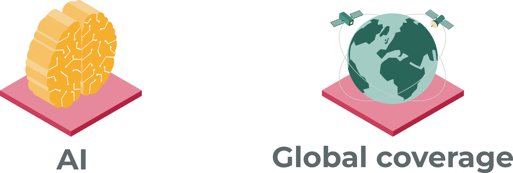
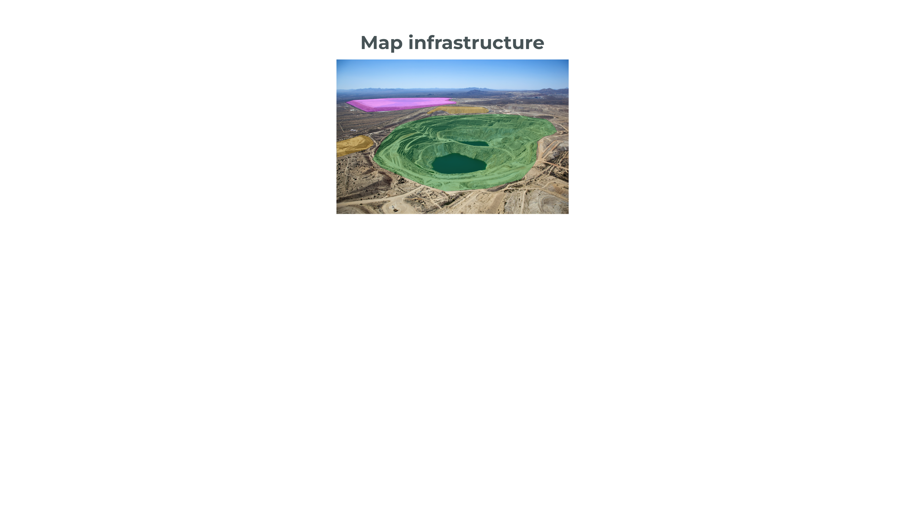
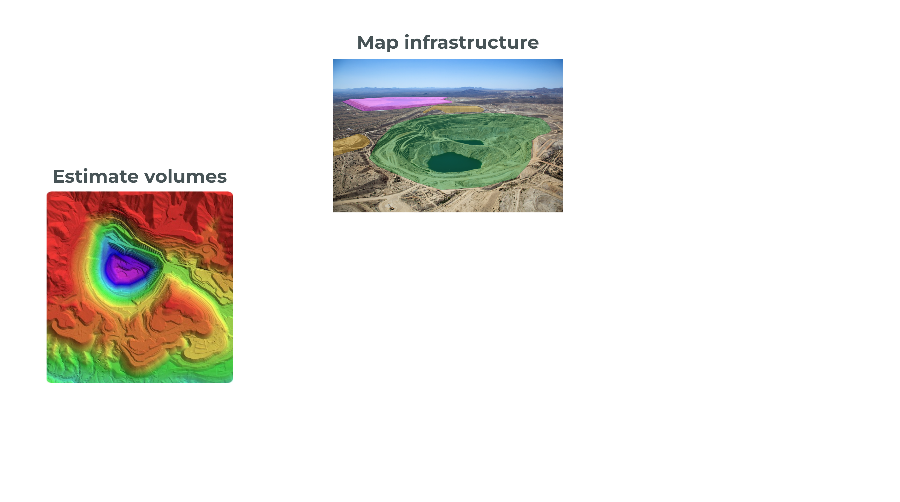
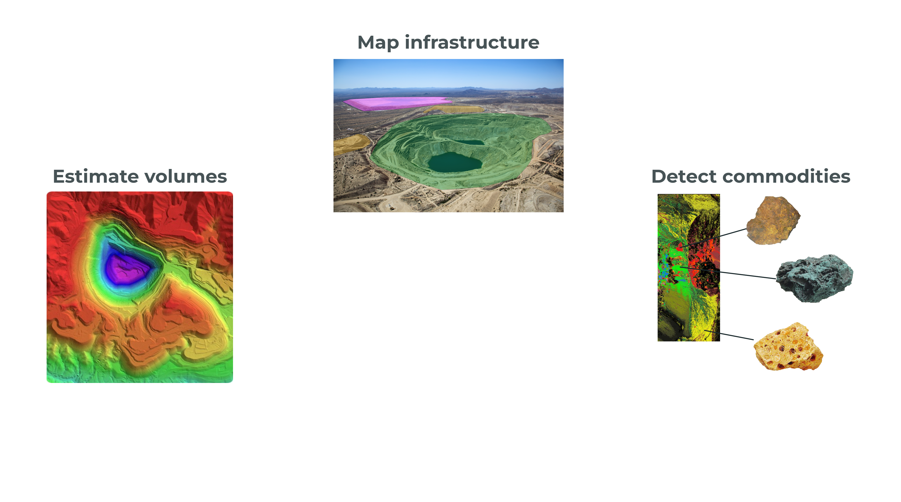
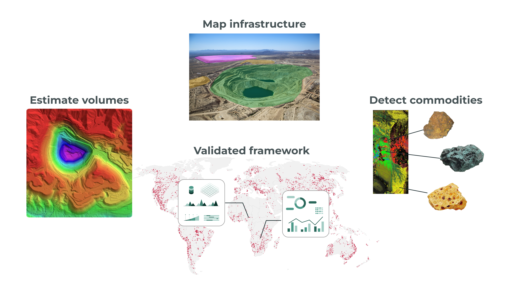

layout: false
class: clear
background-image: url(./img/gap_map-red.png)
background-size: 120%
background-position: 70% 30%
count: true
# Knowledge Gap
.citations[Source: [**Maus & Werner (2024) *Nature***](http://doi.org/10.1038/d41586-023-04090-3)]
???
- In this map you can see the spatial distribution of this information gap
- That's,
- ¤
- undocumented mines are actually a global issue
- ¤
- ¤
- And, what I see as the main reason for this gap:
- ¤
- is that **we lack methods** to measure mining impacts in a consistent way
- ¤
- And, therefore, in the MINE-THE-GAP project, I want to investigate the following research question:

---
layout: false
class: clear
background-image: url(./img/gap_map-red.png)
background-size: 120%
background-position: 70% 30%
count: false
# Knowledge Gap
.citations[Source: [**Maus & Werner (2024) *Nature***](http://doi.org/10.1038/d41586-023-04090-3)]
.bg-dr-white[
  .font-dark.opac-80.font250[Timely, locally relevant, and globally reliable mine-level indicators?]
]
???
- How to produce timely, locally relevant, and globally reliable mine-level indicators?

<!-- ###################################################### Aim and approach -->
---
layout: false
class: 
count: true
# Aim and methods

???
- The aim of my project is:
- To develop scalable models to map mining indicators using AI and satellite EO
- To achieve that:

---
layout: false
class: 
count: false
# Aim and methods

???
- I will combine multi-modal remote sensing data, in an innovative manner
- ¤
- Specifically, we will use highly accurate satellite images with high resolution to increase the availability of training data
- ¤
- And, on the other hand, we will use satellites with lower resolution but continues global coverage, 
- to compose the predictors space of the AI models
- ¤
- In this way, we will be able to provide sufficient training data to produce reliable models,
- and that can be applied globally

<!-- ######################################################## Implementation -->
---
layout: false
class: 
count: true
# Outcomes

???
- The project will produce several outcomes
- First, we will produce models to map mining land use indicators
- That is, the geolocation of mining infrastructures, such open pits and waste piles

---
layout: false
class: 
count: false
# Outcomes

???
- Next we will add a third dimension to the land use indicators,
- by producing models to measure the volumes of mining infrastructures
- This will help estimate, for instance, how much waste is generated in mining

---
layout: false
class: 
count: false
# Outcomes

???
- The third outcome are models to detect commodities associated with mines
- These will help link mining impacts to their underling economic drivers

---
layout: false
class: 
count: false
# Outcomes

???
- And finally:
- We integrate the three sets of models into a validated framework to
- produce information on where, when, what, and how much is mined worldwide

<!-- ############################################################### Outlook -->
---
layout: false
class: outlook-slide
count: true
# Outlook
.mtg-illustration-outlook[]

<!-- .font150.font-dark.opac-80[Understand the impacts of the increasing demand for minerals] -->

???
- In conclusion
- ¤
- The global energy transition and digitalization are substantially increasing demand for minerals
- ¤
- But we currently have a blind spot on understanding the impacts of minerals extraction
- ¤
- The MINE-THE-GAP project addresses the urgent need for spatial information on mining globally,
- and proposes three key innovations

---
layout: false
class: outlook-slide
count: false
# Outlook
.mtg-illustration-outlook[]

<!-- .font150.font-dark.opac-80[Understand the impacts of the increasing demand for minerals] -->

### Innovation
.font130.font-dark.opac-80[
<ul style="line-height: 40px;">
<li>New set of indictors to measure mining impacts</li>
<li>Scalable methods to map mine-level indicators globally</li>
<li>Comprehensive mining data independent from reports</li>
</ul>
</ul>
]
???
- The first is, 
- A new set of indictors to measure mining impacts using satellites and AI
- Second,
- we develop new methods to enable mapping these indicators globally
- And third,
- We will produce new spatial data on mining that is independent from company reports
- ¤
- I envision that these innovations will have a wide range of impacts in academia and society

---
layout: false
class: outlook-slide
count: false
# Outlook
.mtg-illustration-outlook[]

<!-- .font150.font-dark.opac-80[Understand the impacts of the increasing demand for minerals] -->

### Innovation
.font130.font-dark.opac-80[
<ul style="line-height: 40px;">
<li>New set of indictors to measure mining impacts</li>
<li>Scalable methods to map mine-level indicators globally</li>
<li>Comprehensive mining data independent from reports</li>
</ul>
]

### Impact
.font130.font-dark.opac-80[
<ul style="line-height: 40px;">
<li>Methods to scale remote sensing applications</li>
<li>Research on mining and sustainability</li>
<li>Transparency in the mining sector</li>
<li>European Green Deal and the SDGs</li>
</ul>
]
???
- For example:
- our methods could be generalized to other remote sensing applications
- The project will also enable research on mining and sustainability which is currently hindered by the lack of data
- Furthermore, it will help increase the transparency of the mining sector
- And finally, 
- Our methods and data will lay the foundation to monitor mining impacts globally,
- Supporting, for example, the aims of the European Green Deal and the SDGs
- ¤
- With that, I thank you and welcome your questions!
