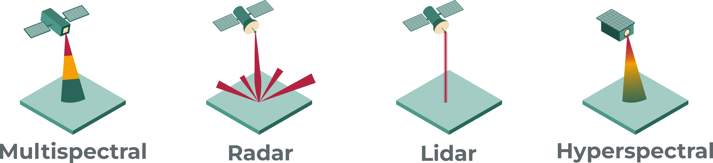
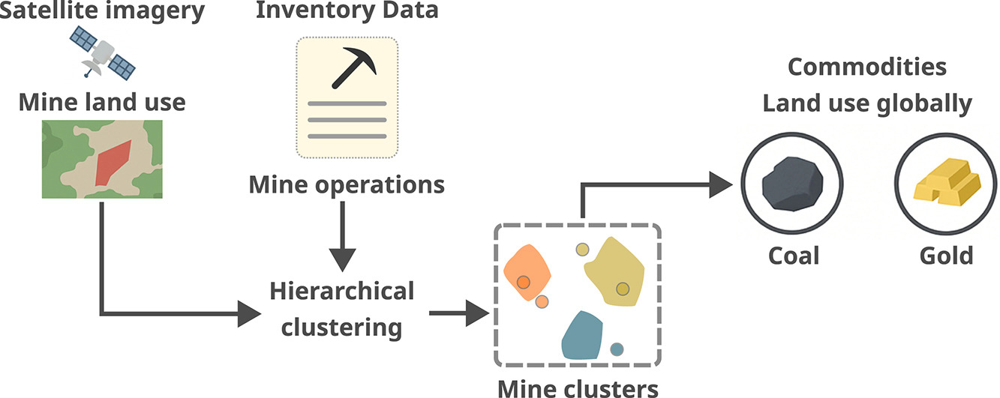
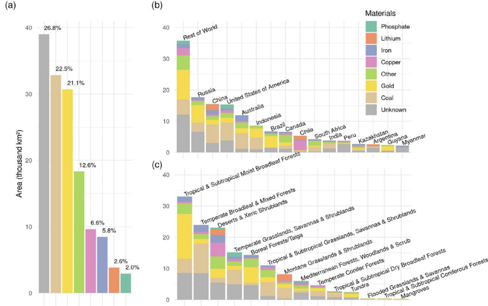
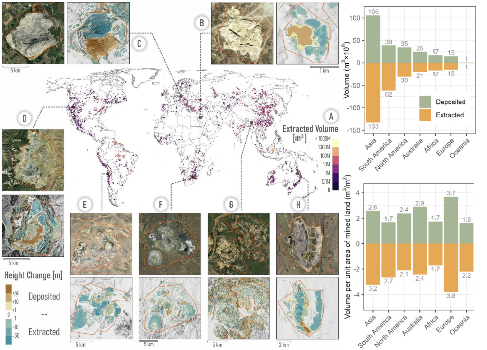

layout: false
class: clear inverse
background-image: url(./img/global-mining-map.png)
background-size: cover
background-position: center
count: true

```{r setup-citations, include=FALSE}
source("./libs/cite-helper.R")
mtg_init_citations("references.bib")
```


<!-- ###################################################### Global mining footprint -->
# Global mining land footprint
.citations[`r cite("maus_2022_global_mining")`]
???
- The mining sector is in the spotlight because of the surge in demand for Critical Raw Materials
- This is the global footprint of mining as we mapped it from satellite imagery
- More than 100,000 sites worldwide — open pits, waste rock piles, tailings dams
- It is the geographical scaffolding on which everything else in this talk builds


<!-- ###################################################### Knowledge Gap -->
---
layout: false
class: clear
background-image: url(./img/gap_map-red.png)
background-size: 120%
background-position: 70% 30%
count: true
# Lack of spatial data
.citations[`r cite("maus_werner_2024_undocumented")`]
.bg-dr-white[
  .font-dark.opac-80.font180[Over half of mining areas lack production data, and information on extractive waste is even scarcer]
]
???
- And yet, when we look at the global picture, more than half of the operating mines worldwide lack basic production data
- the gap is indiscriminate — it occurs across commodities and locations
- Reports are largely incomplete and voluntary
- Information on tailings dams, waste rock, and waste volumes — directly relevant to this session — is even scarcer


<!-- ##################################################### Approach -->
---
layout: false
class:
count: true
# MINE-THE-GAP's aim




.key-point.font140.font-dark.opac-80[Integrate multi-sensor satellite Earth observation data using Artificial Intelligence to produce new mining indicators at global scale]

???
- Our approach pairs the global, continuous coverage of operational satellites
- with higher-precision data sources that anchor the training of AI models
- I am keeping the methodological details deliberately at this level today — the project is just starting and we want to give the methods room to mature before we share them in detail


<!-- ##################################################### Mining data integration -->
---
layout: false
class:
count: true
# Mining data integration



.key-point.font130.font-dark.opac-80[Unsupervised clustering to link satellite-derived mine land-use and mine operation data reduces subjectivity and increases the linking accuracy]
.citations[`r cite("maus_2026_commodities")`  ·  `r cite("maus_borin_2026_clustering")`]
???
- Mining data come from many sources — corporate reports, regulatory registers, geological surveys, satellite-derived inventories
- We integrate them via scalable hierarchical clustering on geographic distance
- The result is a single, site-level inventory consistent across data providers


<!-- ##################################################### Commodity-specific land use -->
---
layout: false
class:
count: true
# Commodity-specific mining land use

.col-fig-gold[
</img>
]

.col-msg-gold[
.font130.font-dark.opac-80[
- Integrated data sources reveal a total of 145,738.1 km² of extractive land globally
- Coal and gold together account for over 43% of global mine land area
- ~27% of mining land could not be linked to a specific commodity
]
]

.citations[`r cite("maus_2026_commodities")`]
???
- A data-driven approach to mapping global mining land use by commodity
- This connects the spatial footprint to its underlying economic driver — what is mined where
- Foundation for downstream impact accounting along the CRM value chain

<!-- ##################################################### Volumetric scale -->
---
layout: false
class:
count: true
# Volumetric assessment

.col-fig[

]

.col-msg[
.font120.font-dark.opac-80[According to the DEM Change, excavations within mining sites total **~279 Bn m³** while deposited materials total **~236 Bn m³** globally (2011–2022)]
]

.citations[`r cite("moudry_inreview_volumes")`  ·  `r cite("lachaise_2022_tandemx_dem")`]
???
- Recent work that I am co-authoring shows the staggering scale of material displacement from surface mining
- Around 279 billion cubic metres extracted, 236 billion deposited, in just over a decade
- Extractive waste deposits are a key part of this picture and a frontier for valorisation
- But the methods behind these numbers do not yet scale consistently to individual sites — that is the gap we want to close


<!-- ##################################################### Closing slide -->
---
layout: false
class: closing-slide closing-slide-final
count: true
# Towards CRM transparency

.font100.font-dark.opac-80[
<ul style="line-height: 44px;">
<li>Methods: Independent, global-scale verification of corporate activities</li>
<li>Reporting: Spatial inventory of extractive waste deposits</li>
<li>Open science: data and methods sharing for science and decision-making</li>
</ul>
]

.font130.font-dark.opac-80[
**Victor Wegner Maus**<br>
[victor.maus@wu.ac.at](mailto:victor.maus@wu.ac.at)<br>
Vienna University of Economics and Business
]

.qr-code-final[]
.qr-code-label[maps.minethegap.eu]

.erc-eu-logo-closing[]
.funding-footnote[
Funded by the European Union. Views and opinions expressed are however those of the author(s) only and do not necessarily reflect those of the European Union or the European Research Council Executive Agency. Neither the European Union nor the granting authority can be held responsible for them.
<br><br>
This work is supported by European Research Council (ERC) project MINE-THE-GAP (grant agreement no. 101170578 — [https://doi.org/10.3030/101170578](https://doi.org/10.3030/101170578)).
]

???
- Thank you — and I welcome your questions


<!-- ##################################################### References -->
```{r refs-slide, results='asis', echo=FALSE}
if (has_citations()) {
  cat("---\n")
  cat("layout: false\n")
  cat("class: refs-slide\n")
  cat("count: true\n")
  cat("# References\n\n")
  cat('<div id="refs">\n')
  cat(bibliography())
  cat("\n</div>\n")
}
```
