```{r setup-citations, include=FALSE}
source("./libs/cite-helper.R")
mtg_init_citations("references.bib")
```

layout: false
class: title-slide
count: false

.wu-logo-white[]

.title-card[
.title[Environmental Assessments of Global Raw Material Extraction]
.author[Victor Maus]
.affiliation[
Research Group Leader, Spatial Data Science<br>
Institute for Ecological Economics<br>
Vienna University of Economics and Business<br>
[victor.maus@wu.ac.at](mailto:victor.maus@wu.ac.at) &nbsp;·&nbsp; [victormaus.github.io](https://victormaus.github.io)
]
]

.accreditation[]

???


<!-- ###################################################### Mining footprint impacts (Sonter 2023) -->
---
layout: false
class: clear
count: true
# Increasing Mining Impacts

.center[
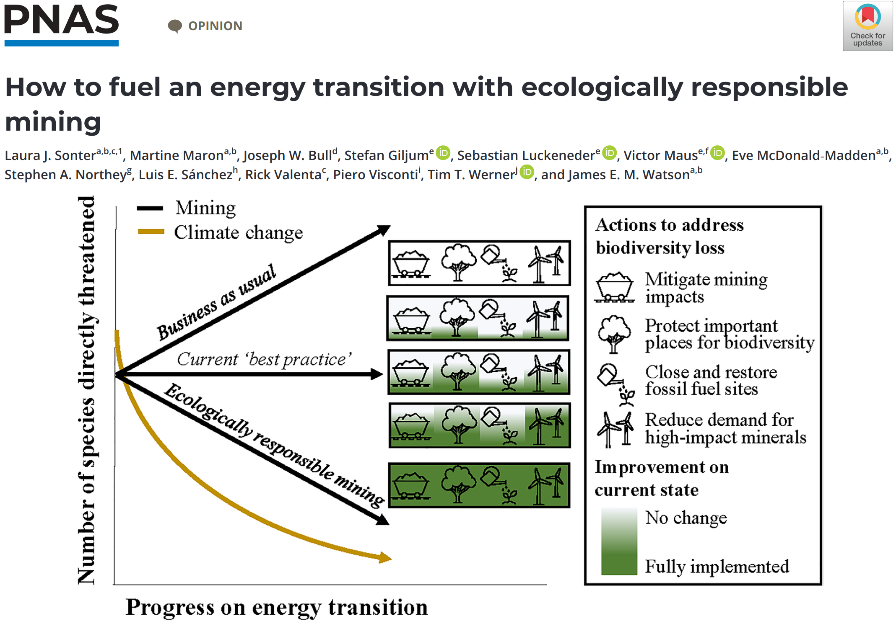
]

.citations[`r cite("sonter_2023_biodiversity")`]

???


<!-- ###################################################### Data gap — Nature 2024 piece -->
---
layout: false
class:
count: true
# Lack of spatial data

.pull-left[

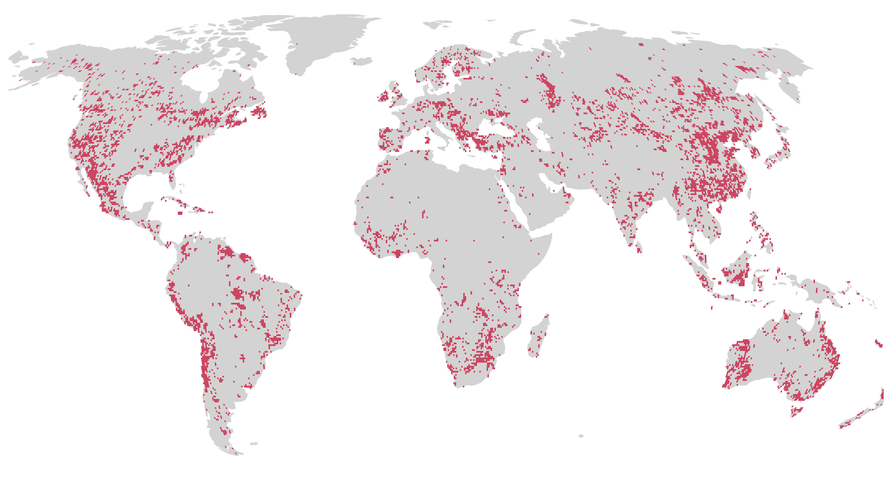
]

.pull-right[

]

.citations[`r cite("maus_werner_2024_undocumented")`]

???


<!-- ##################################################### Mine Footprint (SANDBAR slide 2) -->
---
layout: false
class:
count: true
# Spatially explicit mining data

<br>
.pull-left[
<div style="text-align: center; font-size: 24px; font-weight: 700; line-height: 1.2; margin-bottom: 12px;">Land use<br/>(Polygons)</div>
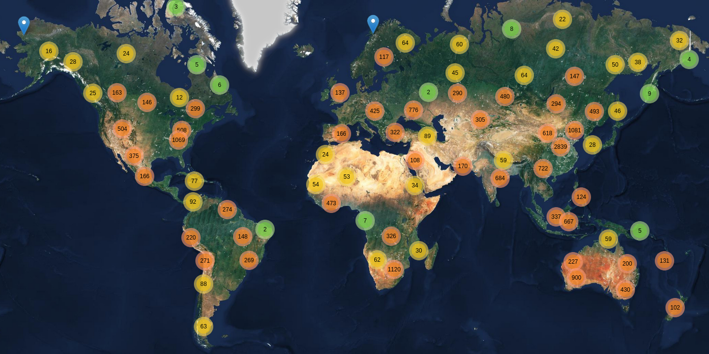
<div style="font-size: 11px; color: #888; margin-top: 4px; line-height: 1.3;">
Maus et al. (2020, 2022) / Nature Scientific Data<br/>
<a href="https://doi.org/10.1038/s41597-022-01547-4">https://doi.org/10.1038/s41597-022-01547-4</a>
</div>
]

.pull-right[
<div style="text-align: center; font-size: 24px; font-weight: 700; line-height: 1.2; margin-bottom: 12px;">Mine operation<br/>(Points)</div>
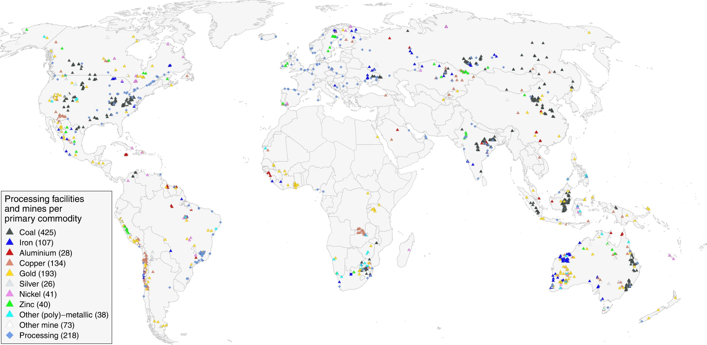
<div style="font-size: 11px; color: #888; margin-top: 4px; line-height: 1.3;">
Jasansky et al. (2023) / Nature Scientific Data<br/>
<a href="https://doi.org/10.1038/s41597-023-01965-y">https://doi.org/10.1038/s41597-023-01965-y</a>
</div>
]

.key-point.font140.font-dark.opac-80[Mine-level assessment requires integrating satellite data and operation inventories]


???


<!-- ##################################################### Mining data integration -->
---
layout: false
class:
count: true
# Mining data integration


.key-point.font140.font-dark.opac-80[Unsupervised clustering to link satellite-derived mine land use and mine operation data reduces subjectivity and increases linking accuracy]
.citations[`r cite("maus_2026_commodities")`  ·  `r cite("maus_borin_2026_clustering")`]

???


<!-- ##################################################### Interactive map — embedded iframe (smaller, navigable) -->
---
layout: false
class:
count: true
# Interactive visualization and open data

<div style="position: absolute; top: 5em; left: 0.5%; width: 100%; height: 70%; overflow: hidden; z-index: 1;">
<iframe src="https://maps.minethegap.eu/"
        style="border: 0; width: calc(100% + 17px); height: 100%; display: block;"
        allow="fullscreen"
        scrolling="no"
        loading="lazy">
</iframe>
</div>

.footnote-right.opac-70.font120[[maps.minethegap.eu](https://maps.minethegap.eu)]

???


<!-- ##################################################### Indicators (SANDBAR slide 3 — re-extracted) -->
---
layout: false
class:
count: true
# Environmental impacts of mining

<!-- Top row: Commodity specific land use (center) + Forest cover loss (right) -->
<div style="position: absolute; top: 3em; left: 10%; width: 36%; text-align: center;">
<span class="ind-label">Commodity-specific land use</span>
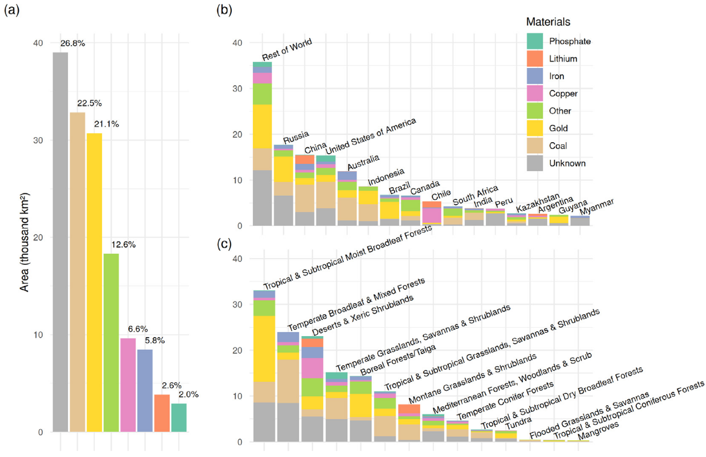
<span class="ind-src">Maus (2026) Journal of Cleaner Production<br/><a href="https://doi.org/10.1016/j.jclepro.2025.147437">https://doi.org/10.1016/j.jclepro.2025.147437</a></span>
</div>

<div style="position: absolute; top: 3em; right: 10em; width: 38%; text-align: center;">
<span class="ind-label">Forest cover loss</span>
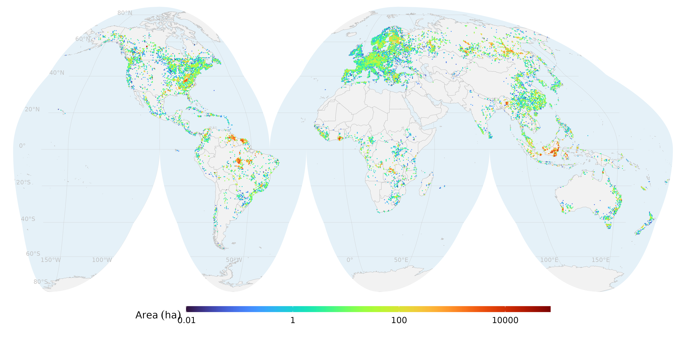
<span class="ind-src">Giljum et al. PNAS (2022, 2023, 2025)<br/><a href="https://doi.org/10.1073/pnas.2118273119">https://doi.org/10.1073/pnas.2118273119</a></span>
</div>

<!-- Bottom row: Mining waste (left) + Indirect forest loss (center) + Biodiversity (right) -->
<div style="position: absolute; bottom: 0.4em; left: 0.5em; width: 23%; text-align: center;">
<span class="ind-label">Quantifying global mining waste</span>
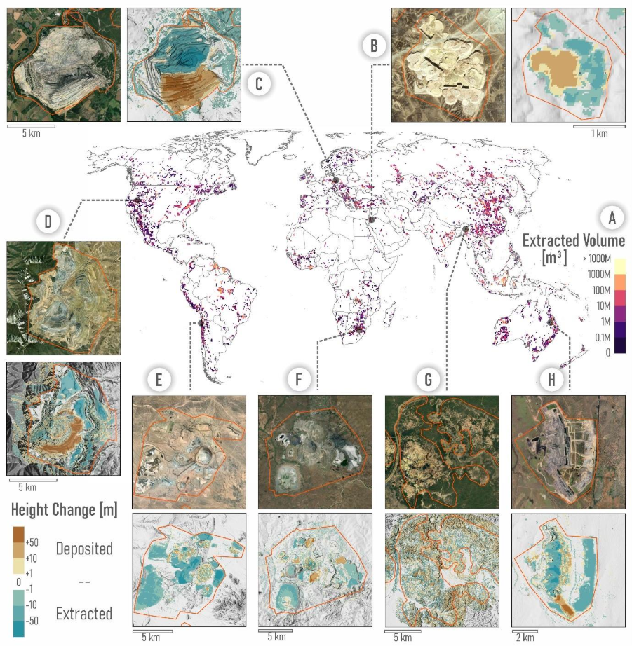
<span class="ind-src">Moudrý et al. IJAEOG (under review)</span>
</div>

<div style="position: absolute; bottom: 1em; left: 27%; width: 38%; text-align: center;">
<span class="ind-label">Indirect forest cover loss</span>
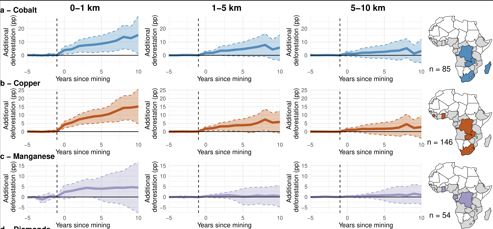
<span class="ind-src">Morton et al. Nature (accepted)</span>
</div>

<div style="position: absolute; bottom: 0.4em; right: 1em; width: 31%; text-align: center;">
<span class="ind-label">Biodiversity exposure to mines</span>
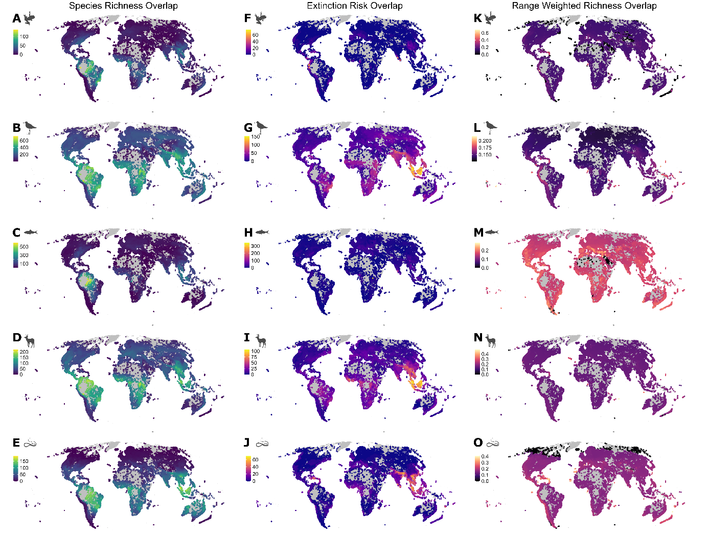
<span class="ind-src">Lamb et al. Nature Ecology &amp; Evolution (under review)</span>
</div>

???


<!-- ##################################################### Spatial heterogeneity and trade-offs (full-screen image) -->
---
layout: false
class: clear, no-logo
background-image: url(./img/copper-water-use.png)
background-size: contain
background-position: center
background-repeat: no-repeat
count: true

???


<!-- ##################################################### Forest Loss on Minerals Supply Chain -->
---
layout: false
class:
count: true
# Forest loss along mineral supply chains

<br>
.center[
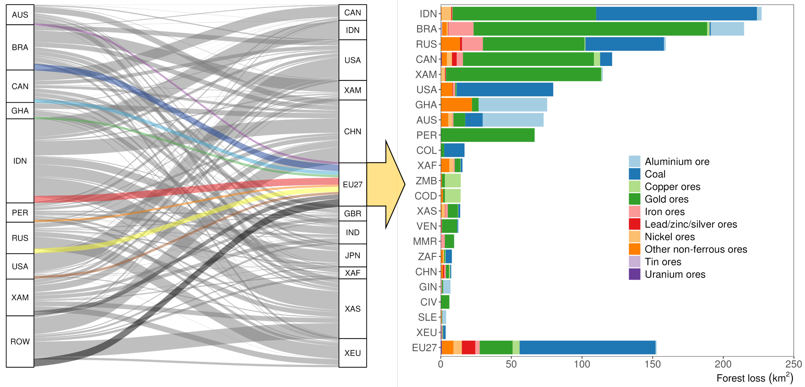
]

.citations[Luckeneder et al. *Resources, Conservation & Recycling* (Under review)]

???


<!-- ##################################################### Third mission — WWF + Guardian -->
---
layout: false
class:
count: true
# Third mission

.pull-left[
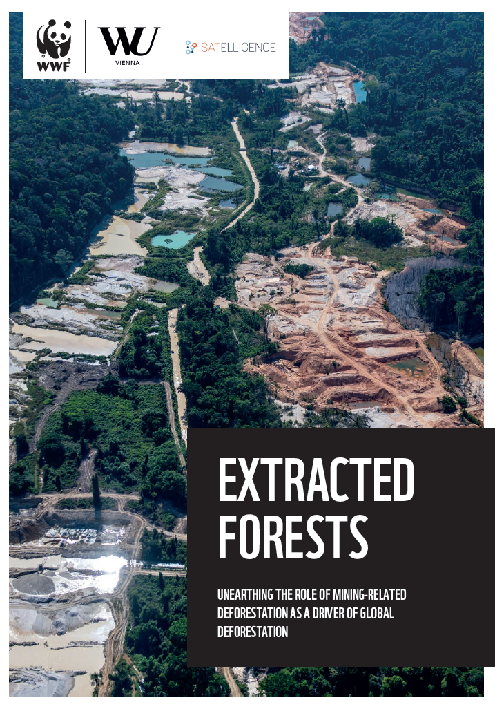
<div style="text-align: center; font-size: 13px; opacity: 0.7;"><a href="https://www.wwf.de/fileadmin/fm-wwf/Publikationen-PDF/Wald/WWF-Studie-Extracted-Forests.pdf">WWF <em>Extracted Forests</em> (2023)</a></div>
]

.pull-right[
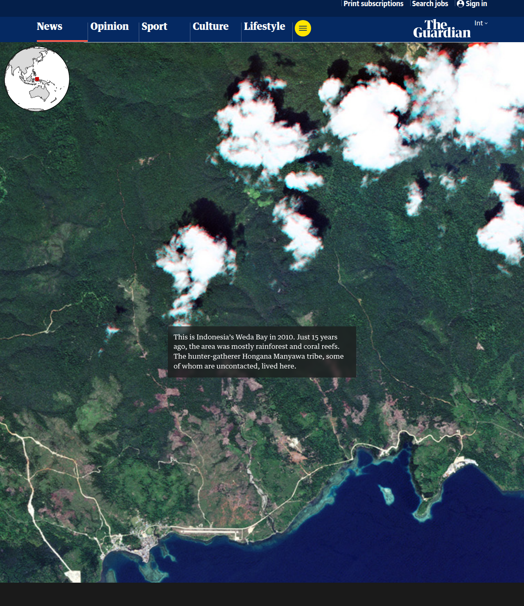
<div style="text-align: center; font-size: 13px; opacity: 0.7;"><a href="https://www.theguardian.com/environment/ng-interactive/2026/mar/11/how-mining-threatens-the-worlds-biodiversity-aoe">The Guardian — Weda Bay (Mar 2026)</a></div>
]

???
- Two examples of research uptake beyond academia
- Left: WWF Extracted Forests policy report (2023)
- Right: The Guardian long-form story on Weda Bay (March 2026)


<!-- ##################################################### Outlook -->
---
layout: false
class:
count: true
# Outlook

.pull-left[
<span class="outlook-h">Improve data coverage based on reports</span>


<div style="display: flex; align-items: center; gap: 12px;">
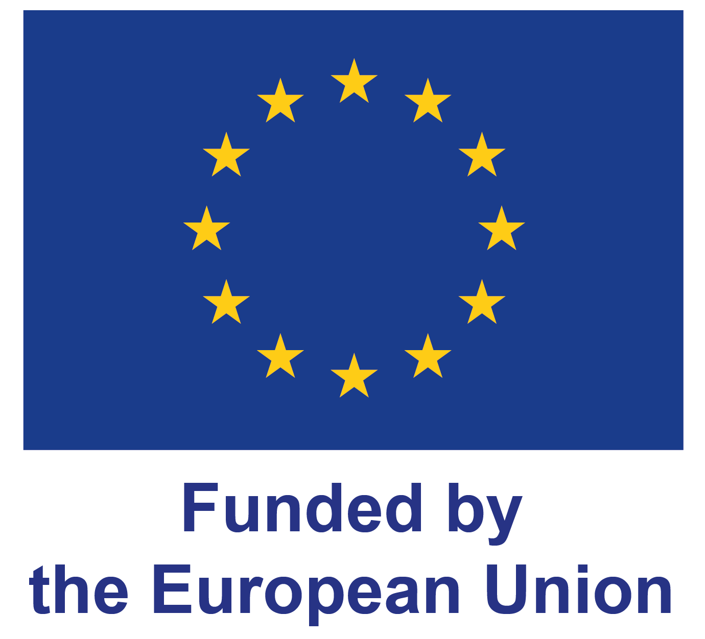
<div>
<strong>RAWCLIC Project (2025–2028)</strong><br/>
<a href="https://doi.org/10.3030/101183654">https://doi.org/10.3030/101183654</a>
</div>
</div>

- Increase coverage of the production database
- Compile variables from sustainability reports
- Estimate water use and mining waste with ML
]

.pull-right[
<span class="outlook-h">Develop new satellite-based indicators</span>

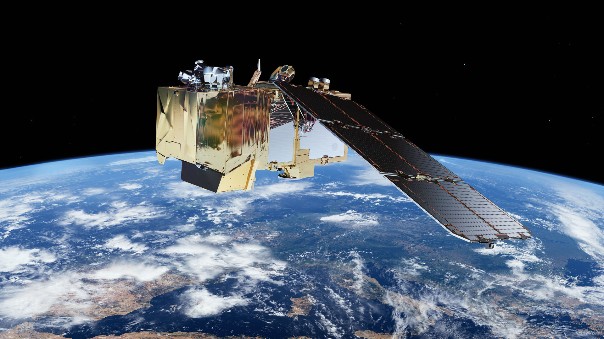

<div style="display: flex; align-items: center; gap: 12px;">

<div>
<strong>MINE-THE-GAP Project (2025–2030)</strong><br/>
<a href="https://doi.org/10.3030/101170578">https://doi.org/10.3030/101170578</a>
</div>
</div>

Integrate multi-sensor satellite EO data using AI to produce new mining indicators: **Land use** · **Waste** · **Minerals**
]

.footnote-left.opac-50.font50[Funded by the European Union. Views and opinions expressed are however those of the author(s) only and do not necessarily reflect those of the European Union or the European Research Council Executive Agency. Neither the European Union nor the granting authority can be held responsible for them.]

???
- 


<!-- =============================================================
     Closing slide — same hero composition as the title
============================================================= -->
---
layout: false
class: closing-slide
count: false

.wu-logo-white[]

.title-card[
.title[Thank you!]
.author[Victor Maus]
.affiliation[
[victor.maus@wu.ac.at](mailto:victor.maus@wu.ac.at)]
.qr-website[[victormaus.github.io](https://victormaus.github.io)]
]

.accreditation[]

???


