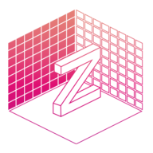
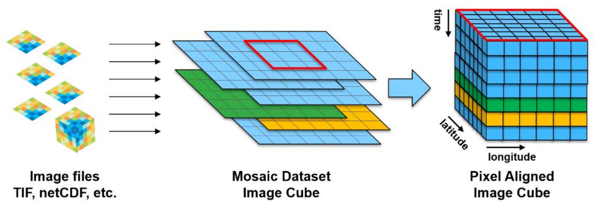
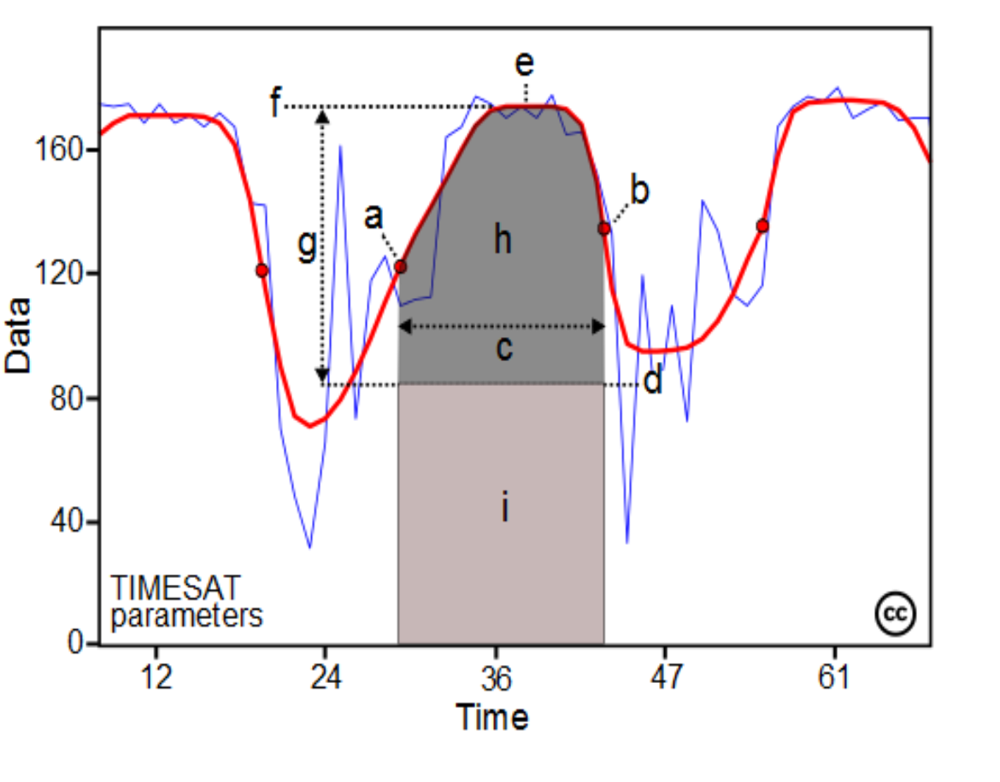
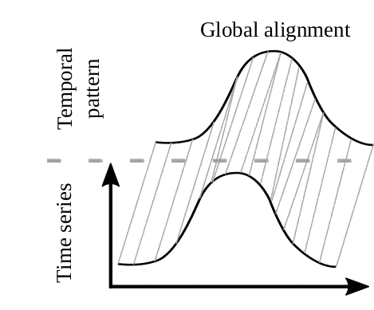
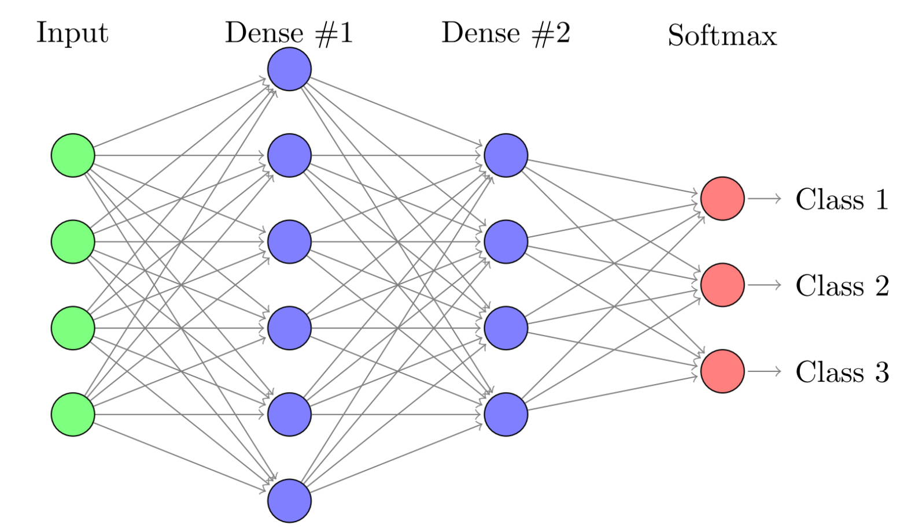
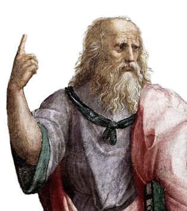
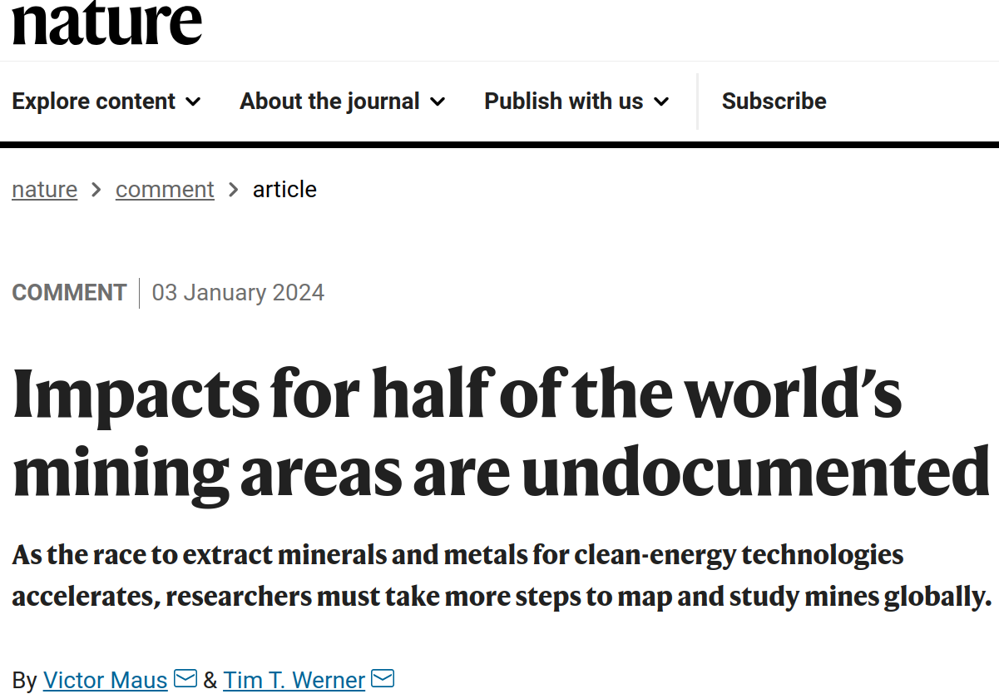
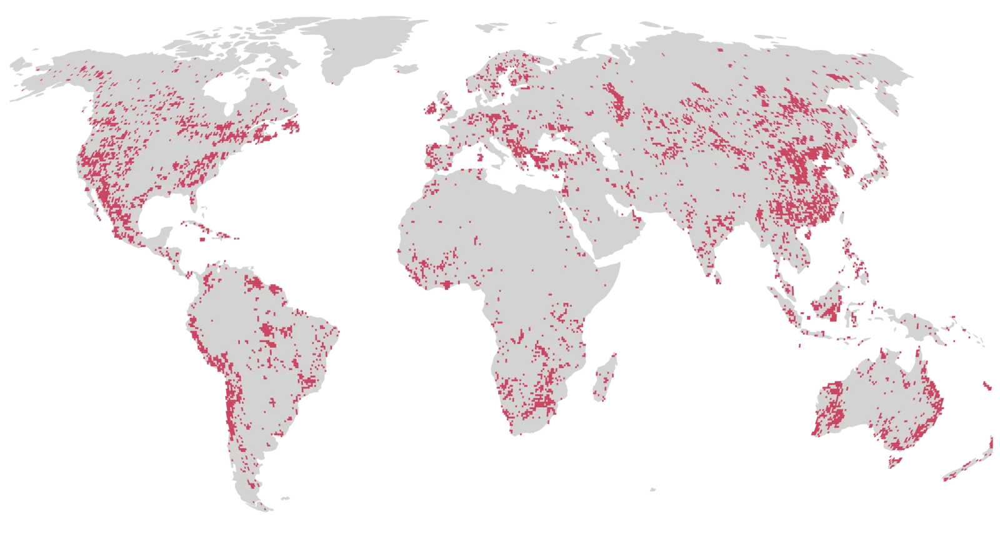
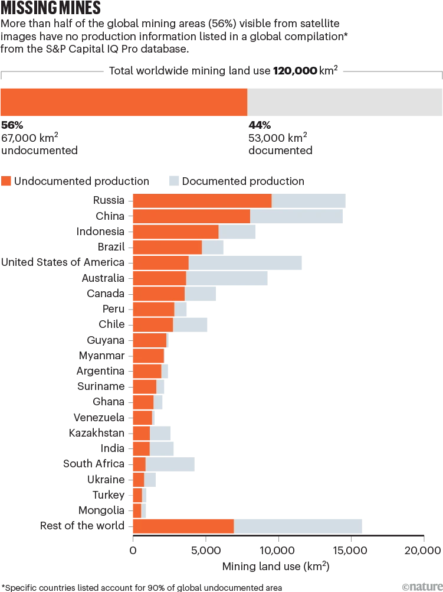
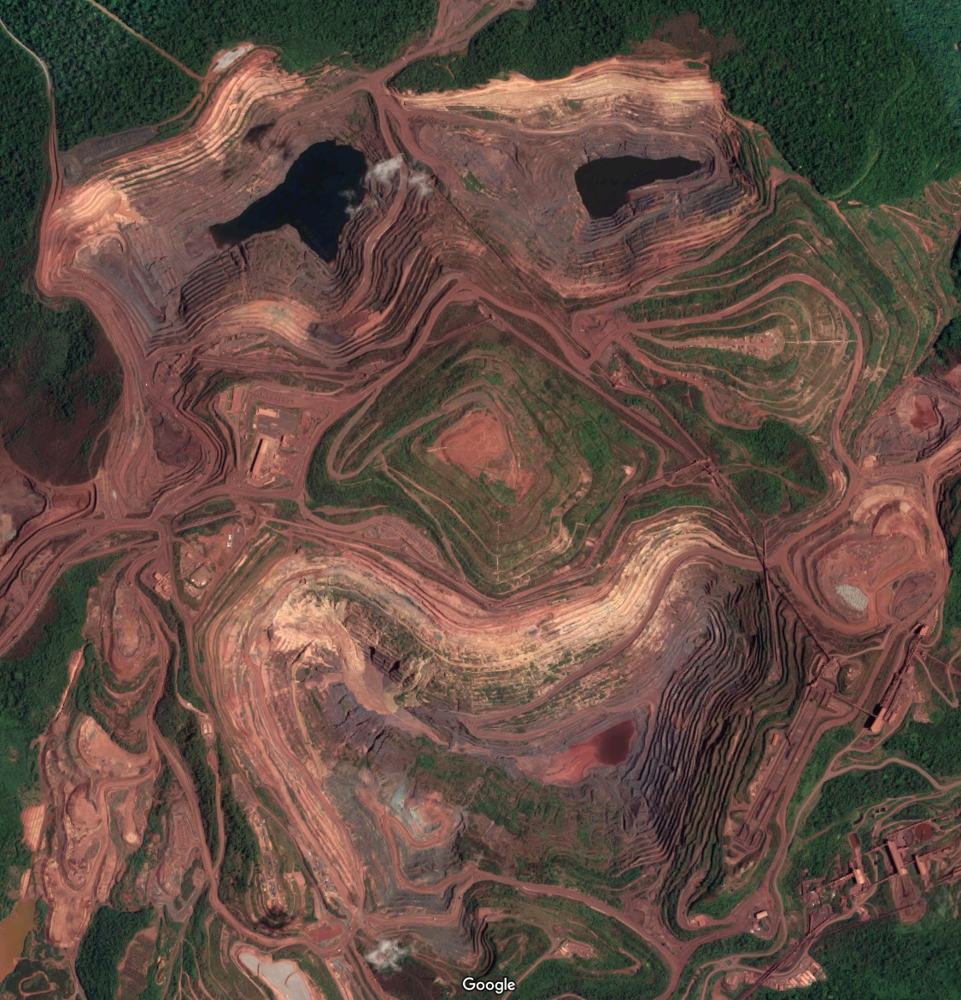

```{r setup-citations, include=FALSE}
source("./libs/cite-helper.R")
mtg_init_citations("references.bib")
xaringanExtra::use_tile_view()
```

layout: false
class: title-slide
count: true

.wu-logo-white[]

.title-card[
.title[Big Earth Observation Data Analytics]
.author[Dr. Victor Maus]
.affiliation[
Research Team Leader on Spatial Data Science<br>
Institute for Ecological Economics<br>
Vienna University of Economics and Business<br>
[victor.maus@wu.ac.at](mailto:victor.maus@wu.ac.at) &nbsp;·&nbsp; [victormaus.github.io](https://victormaus.github.io)
]
]

.accreditation[]

???


<!-- ============================================================
     PART 1 — BIG-EO DATA DEMOCRATIZATION
============================================================ -->


<!-- ##################################################### Big-data volumes (scale chart) -->
---
layout: false
class: inverse
background-image: url(./img/section-bigdata-hero.jpg)
background-size: cover
count: true


<div class="volumes-slide">

<div class="vol-row">

<div class="vol-interactive">
<iframe src="./img/earth_observation_data_growth.html" title="Earth observation data growth" loading="lazy"></iframe>
</div>

</div>

<div class="vol-msg">
<div class="vol-msg-card">
The open EO archive grows at an exponential rate, roughly doubling every 3&ndash;4 years. The recent NISAR satellite alone generates 85 TB of data per day.
</div>
</div>

</div>

.cc-bottom-left.font-light[Image: NASA / Apollo 17 (public domain) &mdash; <a href="https://commons.wikimedia.org/wiki/File:The_Earth_seen_from_Apollo_17.jpg">Wikimedia Commons</a>]


???


<!-- ##################################################### Open data — Leila Fonseca quote -->
---
layout: false
class:
count: true


<div class="open-quote">
<div class="quote-mark">&ldquo;</div>
<div class="quote-text">The free data policy adopted by INPE in 2004 enabled new business and increased the number of users of Earth observation data in Brazil, and also encouraged USGS and ESA to open Landsat and Sentinel data access, respectively.</div>
<div class="quote-attr">&mdash;Dr. Leila Fonseca, Brazilian National Institute for Space Research (INPE)</div>
</div>

<div class="open-timeline">
<svg viewBox="0 0 900 140" width="100%" style="max-width: 900px; display: block; margin: 0 auto;">
  <!-- Horizontal connecting line -->
  <line x1="120" y1="80" x2="780" y2="80" stroke="#1f9e89" stroke-width="3"/>

  <!-- Node 1: INPE 2004 -->
  <circle cx="120" cy="80" r="14" fill="#1f9e89" stroke="#fff" stroke-width="3"/>
  <text x="120" y="48" text-anchor="middle" font-size="22" font-weight="700" fill="#0e6b5d">2004</text>
  <text x="120" y="116" text-anchor="middle" font-size="15" font-weight="700" fill="#222">INPE</text>
  <text x="120" y="132" text-anchor="middle" font-size="12" fill="#666">CBERS imagery</text>

  <!-- Node 2: USGS Landsat 2008 -->
  <circle cx="384" cy="80" r="14" fill="#1f9e89" stroke="#fff" stroke-width="3"/>
  <text x="384" y="48" text-anchor="middle" font-size="22" font-weight="700" fill="#0e6b5d">2008</text>
  <text x="384" y="116" text-anchor="middle" font-size="15" font-weight="700" fill="#222">USGS</text>
  <text x="384" y="132" text-anchor="middle" font-size="12" fill="#666">Landsat archive</text>

  <!-- Node 3: ESA Sentinel 2014 -->
  <circle cx="780" cy="80" r="14" fill="#1f9e89" stroke="#fff" stroke-width="3"/>
  <text x="780" y="48" text-anchor="middle" font-size="22" font-weight="700" fill="#0e6b5d">2014</text>
  <text x="780" y="116" text-anchor="middle" font-size="15" font-weight="700" fill="#222">ESA</text>
  <text x="780" y="132" text-anchor="middle" font-size="12" fill="#666">Sentinel / Copernicus</text>
</svg>
</div>

???


<!-- ##################################################### The software response -->
---
layout: false
class:
count: true
# The software response

<div class="soft-response">

<div class="soft-col">
<h3>Open formats</h3>
<div class="subh">storage layer</div>
<div class="logos">
<div class="logo-item"><div class="logo-name">COG</div></div>
<div class="logo-item"><div class="logo-name">Zarr</div></div>
<div class="logo-item"><div class="logo-name">GeoParquet</div></div>
</div>
<div class="extras">cloud-native rasters, N-D arrays, vector tables<br/><em>+ NetCDF, HDF5</em></div>
</div>

<div class="soft-col">
<h3>Open APIs</h3>
<div class="subh">service layer</div>
<div class="logos">
<div class="logo-item"><div class="logo-name"></div></div>
<div class="logo-item"><div class="logo-name"></div></div>
</div>
<div class="extras">STAC = discovery · openEO = processing<br/><em>OGC API, CEOS ARD</em></div>
</div>

<div class="soft-col">
<h3>Open libraries</h3>
<div class="subh">client/application layer</div>
<div class="logos">
<div class="logo-item"><div class="logo-name"></div></div>
<div class="logo-item"><div class="logo-name">Dask</div></div>
<div class="logo-item"><div class="logo-name"></div></div>
</div>
<div class="extras">N-D arrays · parallel runtime · platform<br/><em>GDAL, rasterio, pystac, ODC</em></div>
</div>

</div>

<div class="soft-tagline">
Interoperable open-source software that makes PB-scale EO usable.
</div>

???


<!-- ##################################################### From files to APIs (EOPF) -->
---
layout: false
class:
count: true
# ESA switches to cloud-native products

<div class="files-vs-apis">

<div class="fva-comparison">

<div class="fva-side fva-before">
<div class="fva-h">Until now</div>
<div class="fva-icon">📦</div>
<div class="fva-body">ESA publishes <strong>SAFE archives</strong> (.zip);<br/>3rd-party clouds reformat to COG / Zarr</div>
</div>

<div class="fva-arrow">&rarr;</div>

<div class="fva-side fva-after">
<div class="fva-h">From 2026/27</div>
<div class="fva-icon">☁️</div>
<div class="fva-body">ESA publishes <strong>Zarr natively</strong>;<br/>query <strong>STAC</strong>, stream from cloud object storage</div>
</div>

</div>

<div class="fva-eopf">

<div class="fva-eopf-cap">ESA's <a href="https://zarr.eopf.copernicus.eu">EOPF Sentinel Zarr</a> &mdash; the whole upstream chain becomes cloud-native by default</div>
</div>

<div class="fva-quote">
Access is now <strong>an API call</strong>, not <em>a file download</em>.
</div>

</div>

???


<!-- ##################################################### ARD pyramid -->
---
layout: false
class:
count: true
# Analysis Ready Data (ARD)

<div class="ard-slide">

<div class="ard-credit">
Figure: Stefan Brand, <a href="https://eox.at">EOX</a> &mdash; ARD references: <a href="https://doi.org/10.3390/rs11091124">Frantz (2019)</a> · <a href="https://doi.org/10.3390/data4030092">Appel &amp; Pebesma (2019)</a>
</div>
</div>

<div class="volumes-takeaway" style="font-size: 28px;">
Raw scenes &rarr; calibrated, gridded, gap-masked tiles &rarr; regular data cubes
</div>

???


<!-- ##################################################### Methodological evolution -->
---
layout: false
class:
count: true
# From engineered features to learned representations

<div class="methods-evo">

<div class="me-labels">
<div class="me-label-col">Dimensionality reduction</div>
<div class="me-label-col">Pattern matching</div>
<div class="me-label-col">Full dimensionality</div>
</div>

<div class="me-image">



</div>

<div class="me-cites">
<div class="me-cite-col"><a href="https://doi.org/10.1016/j.cageo.2004.05.006" target="_blank" rel="noopener"><strong>TIMESAT</strong><br/><span>J&ouml;nsson &amp; Eklundh, 2004</span></a></div>
<div class="me-cite-col"><a href="https://doi.org/10.1109/JSTARS.2016.2517118" target="_blank" rel="noopener"><strong>TWDTW</strong><br/><span>Maus et al., 2016</span></a></div>
<div class="me-cite-col"><a href="https://doi.org/10.3390/rs11050523" target="_blank" rel="noopener"><strong>Deep learning</strong><br/><span>Pelletier et al., 2022</span></a></div>
</div>

</div>


???

<!-- ##################################################### Archived: Data types and sensors -->
---
layout: false
count: true
# Earth Observation Images

<div class="sensor-cards">

<div class="scard">
<svg viewBox="0 0 160 120" class="scard-svg">
  <!-- Sun -->
  <circle cx="20" cy="20" r="10" fill="#f59e0b"/>
  <g stroke="#f59e0b" stroke-width="1.5">
    <line x1="20" y1="4" x2="20" y2="0"/>
    <line x1="36" y1="20" x2="40" y2="20"/>
    <line x1="20" y1="36" x2="20" y2="40"/>
    <line x1="4" y1="20" x2="0" y2="20"/>
    <line x1="30" y1="8" x2="33" y2="5"/>
    <line x1="30" y1="32" x2="33" y2="35"/>
    <line x1="10" y1="32" x2="7" y2="35"/>
    <line x1="10" y1="8" x2="7" y2="5"/>
  </g>
  <!-- Satellite -->
  <g transform="translate(120, 30)">
    <rect x="-8" y="-8" width="16" height="16" fill="#444"/>
    <rect x="-22" y="-3" width="12" height="6" fill="#3399cc"/>
    <rect x="10" y="-3" width="12" height="6" fill="#3399cc"/>
  </g>
  <!-- Sun rays down -->
  <line x1="30" y1="30" x2="55" y2="95" stroke="#f59e0b" stroke-width="2"/>
  <!-- Reflected light: 3 broad visible bands (RGB) + 2 grey bands (NIR / SWIR) -->
  <line x1="54" y1="96" x2="113" y2="36" stroke="#9ca3af" stroke-width="2.5"/>
  <line x1="58" y1="98" x2="115" y2="38" stroke="#1f9e89" stroke-width="2.5"/>
  <line x1="62" y1="100" x2="117" y2="40" stroke="#c41e3a" stroke-width="2.5"/>
  <line x1="66" y1="102" x2="119" y2="42" stroke="#0072B2" stroke-width="2.5"/>
  <line x1="70" y1="104" x2="121" y2="44" stroke="#6b7280" stroke-width="2.5"/>
  <!-- Ground -->
  <path d="M 0,100 L 160,100 L 160,120 L 0,120 Z" fill="#9ca3af"/>
  <path d="M 40,100 Q 60,92 80,100 Q 100,92 120,100" fill="#7a886e" stroke="none"/>
</svg>
<div class="scard-h">Multispectral cameras</div>
<div class="scard-eg">(e.g. Sentinel-2 · Landsat · Planet)</div>
</div>

<div class="scard">
<svg viewBox="0 0 160 120" class="scard-svg">
  <defs>
    <marker id="sar-tx-head" viewBox="0 0 10 10" refX="9" refY="5" markerWidth="5" markerHeight="5" orient="auto">
      <path d="M 0 0 L 10 5 L 0 10 z" fill="#0072B2"/>
    </marker>
    <marker id="sar-rx-head" viewBox="0 0 10 10" refX="9" refY="5" markerWidth="5" markerHeight="5" orient="auto">
      <path d="M 0 0 L 10 5 L 0 10 z" fill="#D55E00"/>
    </marker>
  </defs>
  <!-- Satellite -->
  <g transform="translate(125, 22)">
    <rect x="-8" y="-8" width="16" height="16" fill="#444"/>
    <rect x="-22" y="-3" width="12" height="6" fill="#3399cc"/>
    <rect x="10" y="-3" width="12" height="6" fill="#3399cc"/>
  </g>
  <!-- Clouds (radar sees through) -->
  <g fill="#d1d5db">
    <ellipse cx="55" cy="55" rx="20" ry="7"/>
    <ellipse cx="78" cy="52" rx="16" ry="6"/>
    <ellipse cx="35" cy="60" rx="13" ry="5"/>
  </g>
  <!-- Transmitted pulse: solid blue, arrowhead auto-oriented toward ground -->
  <line x1="115" y1="32" x2="62" y2="90" stroke="#0072B2" stroke-width="2.8" marker-end="url(#sar-tx-head)"/>
  <text x="38" y="80" font-size="9" fill="#0072B2" font-weight="700" text-anchor="middle">pulse</text>
  <!-- Backscatter: dashed orange, arrowhead auto-oriented toward satellite -->
  <line x1="78" y1="92" x2="128" y2="34" stroke="#D55E00" stroke-width="2.2" stroke-dasharray="4 2" marker-end="url(#sar-rx-head)"/>
  <text x="128" y="82" font-size="9" fill="#D55E00" font-weight="700" text-anchor="middle">backscatter</text>
  <!-- Ground -->
  <path d="M 0,100 L 160,100 L 160,120 L 0,120 Z" fill="#9ca3af"/>
</svg>
<div class="scard-h">Synthetic-aperture radar</div>
<div class="scard-eg">(e.g. Sentinel-1 · NISAR)</div>
</div>

<div class="scard">
<svg viewBox="0 0 160 120" class="scard-svg">
  <!-- Sun -->
  <circle cx="20" cy="20" r="9" fill="#f59e0b"/>
  <g stroke="#f59e0b" stroke-width="1.5">
    <line x1="20" y1="5" x2="20" y2="1"/>
    <line x1="35" y1="20" x2="39" y2="20"/>
    <line x1="20" y1="35" x2="20" y2="39"/>
    <line x1="5" y1="20" x2="1" y2="20"/>
  </g>
  <!-- Satellite -->
  <g transform="translate(125, 24)">
    <rect x="-8" y="-8" width="16" height="16" fill="#444"/>
    <rect x="-22" y="-3" width="12" height="6" fill="#3399cc"/>
    <rect x="10" y="-3" width="12" height="6" fill="#3399cc"/>
  </g>
  <!-- Sun ray down -->
  <line x1="26" y1="28" x2="56" y2="90" stroke="#f59e0b" stroke-width="2"/>
  <!-- Reflection going up — dense fan of many narrow contiguous bands -->
  <g stroke-width="1.3" fill="none">
    <line x1="60" y1="92" x2="115" y2="32" stroke="#7c3aed"/>
    <line x1="60" y1="92" x2="118" y2="35" stroke="#3b82f6"/>
    <line x1="60" y1="92" x2="120" y2="38" stroke="#0891b2"/>
    <line x1="60" y1="92" x2="121" y2="41" stroke="#10b981"/>
    <line x1="60" y1="92" x2="122" y2="44" stroke="#84cc16"/>
    <line x1="60" y1="92" x2="123" y2="47" stroke="#facc15"/>
    <line x1="60" y1="92" x2="124" y2="50" stroke="#f97316"/>
    <line x1="60" y1="92" x2="125" y2="53" stroke="#dc2626"/>
    <line x1="60" y1="92" x2="125" y2="56" stroke="#991b1b"/>
  </g>
  <!-- Ground -->
  <path d="M 0,100 L 160,100 L 160,120 L 0,120 Z" fill="#9ca3af"/>
  <path d="M 40,100 Q 55,94 70,100" fill="#7a886e" stroke="none"/>
</svg>
<div class="scard-h">Hyperspectral imagers</div>
<div class="scard-eg">(e.g. EnMAP · PRISMA · CHIME (upcoming))</div>
</div>

<div class="scard">
<svg viewBox="0 0 160 120" class="scard-svg">
  <!-- Satellite -->
  <g transform="translate(80, 18)">
    <rect x="-8" y="-8" width="16" height="16" fill="#444"/>
    <rect x="-22" y="-3" width="12" height="6" fill="#3399cc"/>
    <rect x="10" y="-3" width="12" height="6" fill="#3399cc"/>
  </g>
  <!-- Laser pulse down (vertical green beam) -->
  <line x1="80" y1="32" x2="80" y2="95" stroke="#007857" stroke-width="3"/>
  <line x1="80" y1="32" x2="80" y2="95" stroke="#82e0aa" stroke-width="1" stroke-dasharray="3 2"/>
  <!-- Tree silhouettes -->
  <g fill="#3a5a40">
    <ellipse cx="40" cy="92" rx="10" ry="14"/>
    <rect x="38" y="92" width="4" height="10" fill="#5d4037"/>
    <ellipse cx="115" cy="88" rx="13" ry="18"/>
    <rect x="113" y="92" width="4" height="14" fill="#5d4037"/>
  </g>
  <!-- Ground -->
  <path d="M 0,103 L 160,103 L 160,120 L 0,120 Z" fill="#9ca3af"/>
</svg>
<div class="scard-h">LiDAR altimeters</div>
<div class="scard-eg">GEDI · ICESat-2</div>
</div>

</div>

<div class="volumes-takeaway" style="font-size: 28px;">
<strong>EO data is much more than RGB images.</strong> It includes measurements that reveal different aspects of our planet far beyond visible light.
</div>

???


<!-- ##################################################### Foundation models / TESSERA -->
---
layout: false
class:
count: true
# Earth Observation Foundation Models

<div class="fm-slide">

<div class="fm-flow">
<svg viewBox="0 0 600 330" xmlns="http://www.w3.org/2000/svg">
  <defs>
    <marker id="fm-arr" viewBox="0 0 10 10" refX="9" refY="5" markerWidth="6" markerHeight="6" orient="auto">
      <path d="M 0 0 L 10 5 L 0 10 z" fill="#666"/>
    </marker>
  </defs>

  <!-- Input 1: Sentinel-2 stack -->
  <g transform="translate(40, 60)">
    <rect x="-8" y="-8" width="56" height="46" fill="#cfe7fb" stroke="#0072B2" stroke-width="1.5"/>
    <rect x="-4" y="-4" width="56" height="46" fill="#a9d3f3" stroke="#0072B2" stroke-width="1.5"/>
    <rect x="0"  y="0"  width="56" height="46" fill="#7fbfe9" stroke="#0072B2" stroke-width="1.5"/>
    <text x="28" y="62" text-anchor="middle" font-size="13" font-weight="700" fill="#0072B2">Sentinel-2</text>
    <text x="28" y="76" text-anchor="middle" font-size="11" fill="#0072B2">10 bands &middot; 10 m</text>
  </g>

  <!-- Input 2: Sentinel-1 stack -->
  <g transform="translate(40, 200)">
    <rect x="-8" y="-8" width="56" height="46" fill="#fbd8b6" stroke="#D55E00" stroke-width="1.5"/>
    <rect x="-4" y="-4" width="56" height="46" fill="#f4b079" stroke="#D55E00" stroke-width="1.5"/>
    <rect x="0"  y="0"  width="56" height="46" fill="#ec8a47" stroke="#D55E00" stroke-width="1.5"/>
    <text x="28" y="62" text-anchor="middle" font-size="13" font-weight="700" fill="#D55E00">Sentinel-1</text>
    <text x="28" y="76" text-anchor="middle" font-size="11" fill="#D55E00">VV &middot; VH SAR</text>
  </g>

  <!-- Multi-year hint -->
  <text x="70" y="305" text-anchor="middle" font-size="11" fill="#666" font-style="italic">multi-year time series</text>

  <!-- Arrows into encoder -->
  <line x1="105" y1="90"  x2="190" y2="150" stroke="#666" stroke-width="2" marker-end="url(#fm-arr)"/>
  <line x1="105" y1="230" x2="190" y2="180" stroke="#666" stroke-width="2" marker-end="url(#fm-arr)"/>

  <!-- Encoder block -->
  <g>
    <rect x="200" y="130" width="135" height="70" fill="#ffffff" stroke="#1A292C" stroke-width="2" rx="6"/>
    <text x="267" y="155" text-anchor="middle" font-size="14" font-weight="700" fill="#1A292C">FOUNDATION</text>
    <text x="267" y="174" text-anchor="middle" font-size="14" font-weight="700" fill="#1A292C">MODEL</text>
    <text x="267" y="190" text-anchor="middle" font-size="10" font-style="italic" fill="#666">self-supervised</text>
  </g>

  <!-- Arrow to embedding -->
  <line x1="340" y1="165" x2="395" y2="165" stroke="#666" stroke-width="2" marker-end="url(#fm-arr)"/>

  <!-- Embedding vector -->
  <g transform="translate(412, 132)">
    <rect x="0" y="0" width="38" height="66" fill="#fdf6d8" stroke="#F6AE2D" stroke-width="2"/>
    <g fill="#1A292C">
      <circle cx="19" cy="9"  r="1.8"/>
      <circle cx="19" cy="17" r="1.8"/>
      <circle cx="19" cy="25" r="1.8"/>
      <circle cx="19" cy="33" r="1.8"/>
      <circle cx="19" cy="41" r="1.8"/>
      <circle cx="19" cy="49" r="1.8"/>
      <circle cx="19" cy="57" r="1.8"/>
    </g>
    <text x="19" y="82" text-anchor="middle" font-size="13" font-weight="700" fill="#a3781a">128-d</text>
    <text x="19" y="96" text-anchor="middle" font-size="10" fill="#666">per pixel</text>
  </g>

  <!-- Fan-out arrows -->
  <line x1="455" y1="148" x2="498" y2="88"  stroke="#666" stroke-width="1.5" marker-end="url(#fm-arr)"/>
  <line x1="455" y1="160" x2="498" y2="148" stroke="#666" stroke-width="1.5" marker-end="url(#fm-arr)"/>
  <line x1="455" y1="172" x2="498" y2="208" stroke="#666" stroke-width="1.5" marker-end="url(#fm-arr)"/>
  <line x1="455" y1="184" x2="498" y2="268" stroke="#666" stroke-width="1.5" marker-end="url(#fm-arr)"/>

  <!-- Task labels -->
  <g font-size="13" font-weight="700" fill="#007857">
    <text x="505" y="92">Land cover</text>
    <text x="505" y="152">Canopy height</text>
    <text x="505" y="212">Biomass</text>
    <text x="505" y="272">Change detection</text>
  </g>
</svg>
</div>

</div>

<div class="fm-src">
Feng et al. (2025), <a href="https://arxiv.org/abs/2506.20380">arXiv:2506.20380</a> &middot; <a href="https://geotessera.org">geotessera.org</a>
</div>

???


<!-- ##################################################### Earth from above — natural vs. anthropogenic patterns -->
---
layout: false
class: clear, no-logo, full-bleed
background-image: url(./img/meandering-mississippi.jpg)
background-size: cover
background-position: center
background-repeat: no-repeat
count: true

.cc-bottom-left.font-light[Landsat 7 &middot; 28 May 2003 &mdash; USGS/NASA <em>Earth as Art</em>: <a href="https://www.usgs.gov/media/images/meandering-mississippi">Meandering Mississippi</a>]

???


<!-- ##################################################### Global datasets lack local relevance — ESA CCI Carajás -->
---
layout: false
class: clear, no-logo, full-bleed
background-image: url(./img/esa-cci-carajas.jpg)
background-size: cover
background-position: center
background-repeat: no-repeat
count: true

.cc-bottom-left.font-light[Map: <a href="http://maps.elie.ucl.ac.be/CCI/viewer/">ESA CCI Land Cover viewer</a> &mdash; Caraj&aacute;s iron-ore complex, Brazil]

???

<!-- ##################################################### Annual-embedding bias (calendar vs phenology) -->
---
layout: false
class:
count: true
# Bias of annual embeddings

<div class="year-bias-slide">

<div class="yb-panel">
<div class="yb-panel-title">MODIS EVI &middot; <em>Mato Grosso, Brazil (&minus;52.452&deg;, &minus;12.333&deg;) &mdash; 2009&ndash;2010</em></div>
<svg viewBox="0 0 1000 500" class="yb-svg" xmlns="http://www.w3.org/2000/svg">
  <!-- Light EVI gridlines -->
  <line x1="50" y1="100" x2="950" y2="100" stroke="#eee" stroke-width="1"/>
  <line x1="50" y1="250" x2="950" y2="250" stroke="#eee" stroke-width="1"/>
  <line x1="50" y1="400" x2="950" y2="400" stroke="#ddd" stroke-width="1.2"/>
  <!-- Y-axis ticks -->
  <text x="44" y="104" font-size="14" fill="#888" text-anchor="end">1.0</text>
  <text x="44" y="254" font-size="14" fill="#888" text-anchor="end">0.5</text>
  <text x="44" y="404" font-size="14" fill="#888" text-anchor="end">0.0</text>
  <text x="44" y="86"  font-size="15" fill="#888" text-anchor="end" font-weight="700">EVI</text>
  <!-- Year separators -->
  <line x1="50"  y1="20" x2="50"  y2="440" stroke="#EB811B" stroke-width="1.5" stroke-dasharray="6 5" opacity="0.6"/>
  <line x1="500" y1="20" x2="500" y2="440" stroke="#EB811B" stroke-width="2.5" stroke-dasharray="7 5"/>
  <line x1="950" y1="20" x2="950" y2="440" stroke="#EB811B" stroke-width="1.5" stroke-dasharray="6 5" opacity="0.6"/>
  <!-- Embedding boxes (both ambiguous) -->
  <rect x="52"  y="24" width="446" height="54" rx="5" fill="rgba(196,30,58,0.07)" stroke="#c41e3a" stroke-width="2.5" stroke-dasharray="7 4"/>
  <text x="275" y="58" font-size="20" fill="#c41e3a" font-weight="700" text-anchor="middle">Embedding 2009</text>
  <rect x="502" y="24" width="446" height="54" rx="5" fill="rgba(196,30,58,0.07)" stroke="#c41e3a" stroke-width="2.5" stroke-dasharray="7 4"/>
  <text x="725" y="58" font-size="20" fill="#c41e3a" font-weight="700" text-anchor="middle">Embedding 2010</text>
  <!-- Real MODIS EVI curve (forest-grass pixel, every ~16 days) -->
  <polyline points="50,362 70,330 89,346 109,356 129,336 149,309 168,303 188,323 208,329 227,349 247,355 267,362 287,361 306,353 326,363 346,362 366,359 385,348 405,339 425,346 445,321 464,286 484,299 500,265 520,221 539,229 559,193 579,250 599,289 618,303 638,313 658,308 677,337 697,344 717,347 737,349 756,350 776,349 796,348 816,356 835,354 855,331 875,330 894,345 914,360 934,262" fill="none" stroke="#1f9e89" stroke-width="3" stroke-linejoin="round"/>
  <!-- Data point markers -->
  <g fill="#1f9e89">
    <circle cx="50"  cy="362" r="2.5"/><circle cx="70"  cy="330" r="2.5"/><circle cx="89"  cy="346" r="2.5"/>
    <circle cx="109" cy="356" r="2.5"/><circle cx="129" cy="336" r="2.5"/><circle cx="149" cy="309" r="2.5"/>
    <circle cx="168" cy="303" r="2.5"/><circle cx="188" cy="323" r="2.5"/><circle cx="208" cy="329" r="2.5"/>
    <circle cx="227" cy="349" r="2.5"/><circle cx="247" cy="355" r="2.5"/><circle cx="267" cy="362" r="2.5"/>
    <circle cx="287" cy="361" r="2.5"/><circle cx="306" cy="353" r="2.5"/><circle cx="326" cy="363" r="2.5"/>
    <circle cx="346" cy="362" r="2.5"/><circle cx="366" cy="359" r="2.5"/><circle cx="385" cy="348" r="2.5"/>
    <circle cx="405" cy="339" r="2.5"/><circle cx="425" cy="346" r="2.5"/><circle cx="445" cy="321" r="2.5"/>
    <circle cx="464" cy="286" r="2.5"/><circle cx="484" cy="299" r="2.5"/><circle cx="500" cy="265" r="2.5"/>
    <circle cx="520" cy="221" r="2.5"/><circle cx="539" cy="229" r="2.5"/><circle cx="559" cy="193" r="2.5"/>
    <circle cx="579" cy="250" r="2.5"/><circle cx="599" cy="289" r="2.5"/><circle cx="618" cy="303" r="2.5"/>
    <circle cx="638" cy="313" r="2.5"/><circle cx="658" cy="308" r="2.5"/><circle cx="677" cy="337" r="2.5"/>
    <circle cx="697" cy="344" r="2.5"/><circle cx="717" cy="347" r="2.5"/><circle cx="737" cy="349" r="2.5"/>
    <circle cx="756" cy="350" r="2.5"/><circle cx="776" cy="349" r="2.5"/><circle cx="796" cy="348" r="2.5"/>
    <circle cx="816" cy="356" r="2.5"/><circle cx="835" cy="354" r="2.5"/><circle cx="855" cy="331" r="2.5"/>
    <circle cx="875" cy="330" r="2.5"/><circle cx="894" cy="345" r="2.5"/><circle cx="914" cy="360" r="2.5"/>
    <circle cx="934" cy="262" r="2.5"/>
  </g>
  <!-- Ground-truth ribbon: pasture | soy | fallow | soy (next) -->
  <rect x="50"  y="410" width="375" height="25" fill="#7a886e"/>
  <rect x="425" y="410" width="213" height="25" fill="#b8860b"/>
  <rect x="638" y="410" width="217" height="25" fill="#c8a878"/>
  <rect x="855" y="410" width="95"  height="25" fill="#b8860b"/>
  <text x="237" y="428" font-size="14" fill="#fff" text-anchor="middle" font-weight="700">pasture</text>
  <text x="531" y="428" font-size="14" fill="#fff" text-anchor="middle" font-weight="700">soy growing season</text>
  <text x="747" y="428" font-size="14" fill="#fff" text-anchor="middle" font-weight="700">fallow</text>
  <!-- Month labels (year boundaries) -->
  <text x="50"  y="465" font-size="14" fill="#666" text-anchor="middle">Jan 2009</text>
  <text x="500" y="465" font-size="14" fill="#666" text-anchor="middle">Jan 2010</text>
  <text x="950" y="465" font-size="14" fill="#666" text-anchor="middle">Jan 2011</text>
</svg>
</div>

</div>


???


<!-- ##################################################### Envisat global land-cover full-bleed -->
---
layout: false
class: clear, no-logo
background-image: url(./img/envisat-global-land-cover.jpg)
background-size: cover
background-position: center
background-repeat: no-repeat
count: true

.cc-bottom-left.font-light[Envisat global land-cover map (GlobCover) &mdash; &copy; ESA &middot; <a href="https://www.esa.int/ESA_Multimedia/Images/2008/12/Envisat_global_land_cover_map">esa.int</a>]

???


<!-- ##################################################### What is a mine? — philosophical bridge -->
---
layout: false
class:
count: true
# What do maps show?

.pull-left.center[
<div style="margin-top: 1.5em;">
<br/>
<strong>Plato</strong> &mdash; categories have <em>objective essences</em>:<br/>one <strong>true definition</strong> holds everywhere &mdash; the assumption behind every global map.<br/>
<span style="font-size: 11px; color: #777;">Image: Raphael, <em>School of Athens</em>, 1511 &middot; CC&nbsp;BY-SA 4.0</span>
</div>
]

.pull-right.center[
<div style="transform: translateX(-3em); margin-top: 1.5em;">
<br/>
<strong>Ludwig Wittgenstein</strong> &mdash; <em>&ldquo;The meaning of a word is its use in the language&rdquo;</em><br/>
<span style="font-size: 11px; color: #777;">Photo: Moritz N&auml;hr, 1929 &middot; public domain</span>
</div>
]


???


<!-- ##################################################### Models transferability -->
---
layout: false
class: transferability-bg
background-image: url(https://media.springernature.com/full/springer-static/image/art%3A10.1038%2Fs41467-022-29838-9/MediaObjects/41467_2022_29838_Fig1_HTML.png?as=webp)
background-size: 42% auto
background-position: right 2em center
background-repeat: no-repeat
count: true

# Model transferability remains <br>a big challenge

<div class="transferability-msg">
Machine-learning algorithms trained on samples with <strong>non-representative spatial and temporal distributions</strong> produce unreliable results outside the sampled region.
</div>

<div class="transferability-src">
Meyer &amp; Pebesma (2022), <a href="https://www.nature.com/articles/s41467-022-29838-9"><em>Nature Communications</em></a>
</div>

???


<!-- ##################################################### Spatial data on mining is scarce and fragmented -->
---
layout: false
class:
count: true
# Spatial data on mining is scarce and fragmented

.pull-left[


]

.pull-right[

]

.citations[`r cite("maus_werner_2024_undocumented")`]

???
- Half of the world&rsquo;s mining areas remain undocumented in open datasets.
- Existing maps are fragmented, locally curated, and inconsistent &mdash; motivating the MINE-THE-GAP integration argument that follows.


<!-- ##################################################### MINE-THE-GAP's aim — integration in practice -->
---
layout: false
class:
count: true
# MINE-THE-GAP's aim


<div class="mtg-aim-key">
Integrate multi-sensor satellite Earth observation data using Artificial Intelligence to produce new mining indicators at global scale
</div>

<div class="mtg-funding">

<div class="mtg-funding-id">MINE-THE-GAP (ERC StG, 2025&ndash;2030)<br/><a href="https://doi.org/10.3030/101170578">doi.org/10.3030/101170578</a></div>
</div>

???


<!-- ##################################################### AI Algorithms Excel at Detecting Regular Patterns -->
---
layout: false
class:
count: true
# AI algorithms excel at detecting regular patterns

.pull-left.center[


<span style="font-size: 11px; color: #777;">Photo: Tiina H&auml;yh&auml;, <a href="https://creativecommons.org/licenses/by-sa/4.0">CC&nbsp;BY-SA 4.0</a></span>
]

.pull-right.center[


<span style="font-size: 11px; color: #777;">Screenshot: <a href="https://goo.gl/maps/xDkqyGdMAn8ZJTZJ7">Google Maps</a> &mdash; Caraj&aacute;s, Brazil</span>
]

???


<!-- ##################################################### Global mining land footprint -->
---
layout: false
class: clear, inverse
background-image: url(./img/global-mining-map.jpg)
background-size: cover
background-position: center
count: true

# Global mining land footprint

.citations[`r cite("maus_2022_global_mining")`]

???
- Global mining land footprint mapped from satellite imagery (Maus et al. 2022).
- ~100,000 sites worldwide &mdash; open pits, waste rock piles, tailings dams.
- The geographical scaffolding for the integration argument in this talk.


<!-- =============================================================
     Closing slide
============================================================= -->
---
layout: false
class: closing-slide
count: false

.wu-logo-white[]

.title-card[
.title[Thank you!]
.author[Victor Maus]
.affiliation[
[victor.maus@wu.ac.at](mailto:victor.maus@wu.ac.at)]
.qr-website[[victormaus.github.io](https://victormaus.github.io)]
]

.accreditation[]

???
